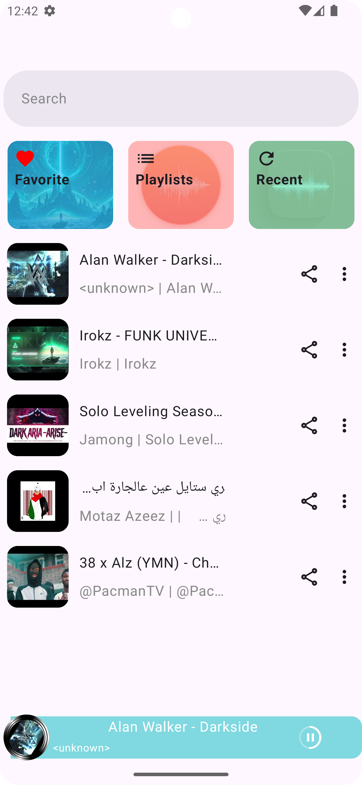
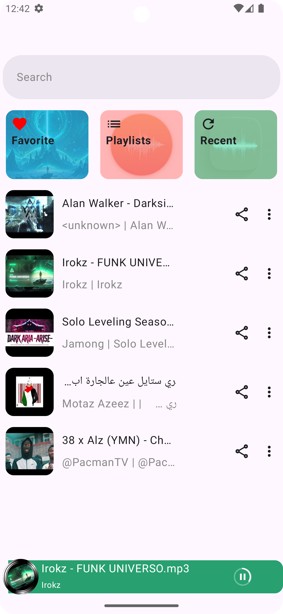
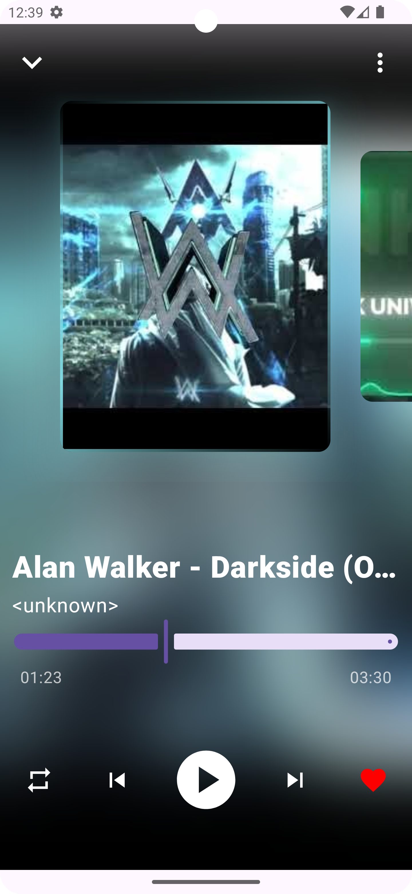
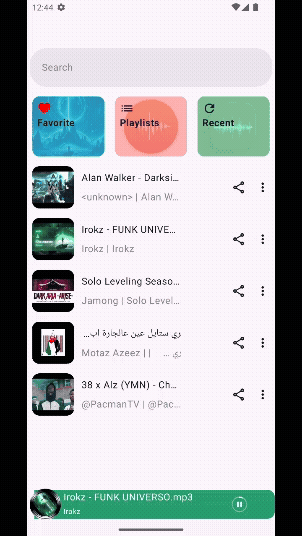

Hi there, I'm Khaled Iqsaea
MusiCo app is a local audio player with smooth and dynamic Ui (on going)

I used the latest Android technologies :
* Jetpack Compose  and Material 3 for Ui
* Kotlin Coroutines & Flows
* Canvas
* Room Database & Data Store
* koin💉
* MVI approach for clean architecture
* Media 3
* Palette API for dynamic colors along with song cover

## 📷 Screenshots

<table style="width:100%">
<tr>
    <th>dynamic bottom bar</th>
    <th>dynamic bottom bar 2</th> 
    <th>dynamic card border</th>
  </tr>
  <tr>
    <td></td> 
    <td></td>
    <td></td> 
  </tr>
  <tr>
    <th>dynamic card border2</th>
    <th>pager animation</th>
    <th>draggable bar</th>
  </tr>
  <tr>
    <td></td>
    <td></td>
    <td></td>

  </tr>

</table>

