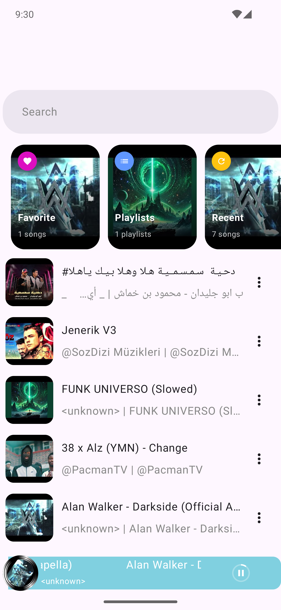
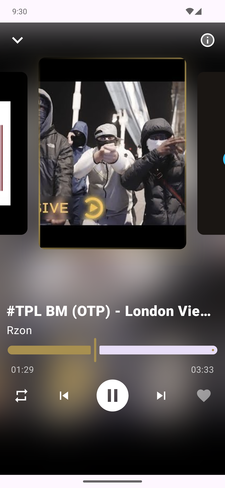
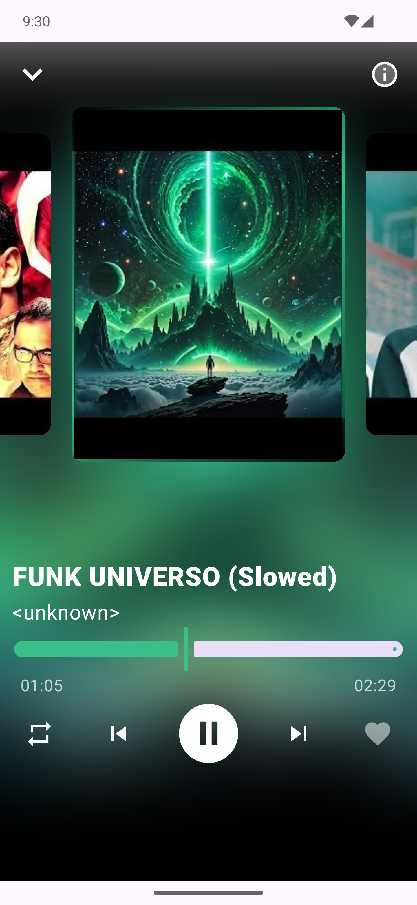
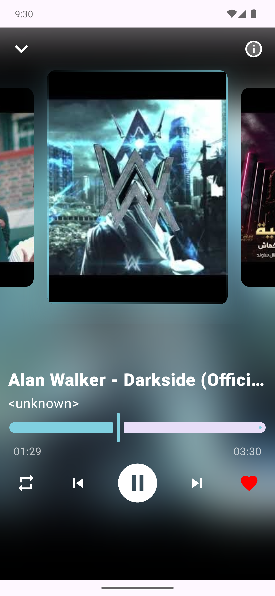
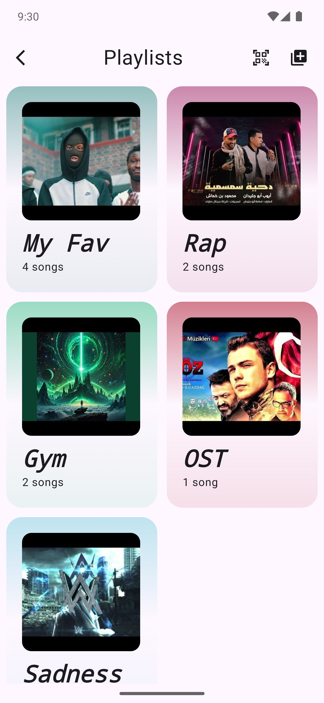
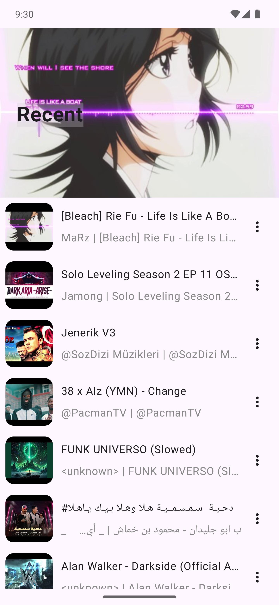
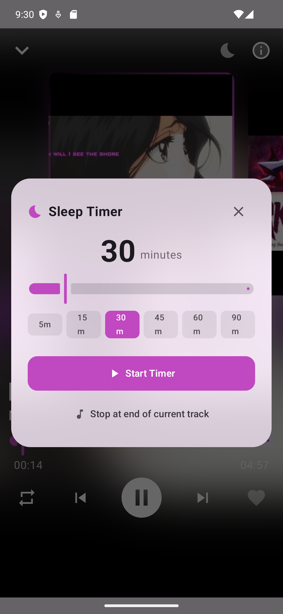
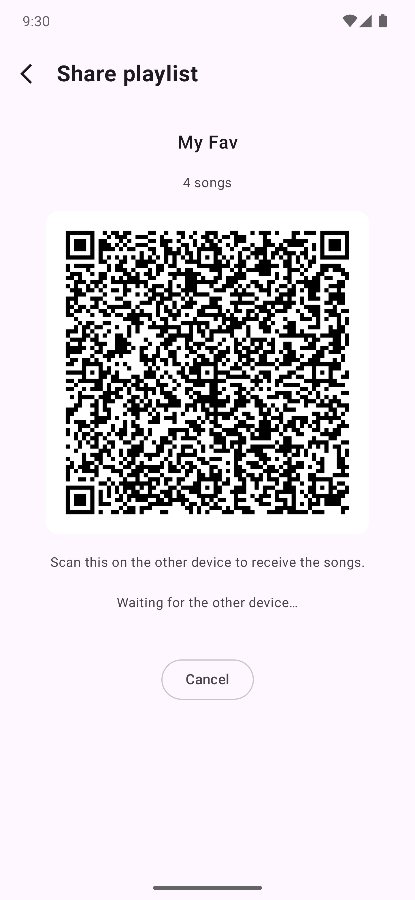

Hi there, I'm Khaled Iqsaea 👋

**MusiCo** is a local audio player for Android with a smooth, dynamic Compose UI (still on going).

## ✨ Features

* **Local library** — reads your on-device music straight from `MediaStore`, any format the system can index (mp3, m4a, opus, flac …)
* **Now playing** with colors pulled from the album art at runtime (Palette API), a swipeable cover pager and a draggable seek bar
* **Playlists, Favorites and Recently played**
* **Sleep timer** — stop playback after 5 / 15 / 30 / 45 / 60 / 90 minutes, or at the end of the current track. The countdown runs in the playback service, so it survives backgrounding and process death.
* **Share a playlist offline** — hand it to a nearby phone as a QR code, no internet involved
* **Send the songs themselves** to a nearby device over a private **Wi-Fi Direct** link — the other phone gets the tracks it's missing
* **Adaptive layout** — reworks itself for phone portrait, phone landscape, tablets and foldables
* **Background playback** with a media notification and lock-screen controls
* **Home-screen widget** with playback controls

## 🛠️ Built with

* Jetpack Compose  and Material 3
* Material 3 Adaptive — layouts for tablets, foldables and landscape
* Navigation Compose
* Kotlin Coroutines & Flow
* Media3 (ExoPlayer + MediaSession) for playback and the media notification
* Room Database & DataStore
* kotlinx.serialization and kotlinx-datetime
* Koin 💉 for dependency injection
* Coil 3 for album-art loading
* Canvas & the Palette API for the dynamic cover colors
* **Ktor** — an embedded CIO server on the sending device and a CIO client on the receiver, for the song transfer
* **Wi-Fi Direct** (`WifiP2pManager`) — the private, internet-free device-to-device link the transfer runs over
* **ZXing** for the pairing / playlist QR codes, **CameraX** for scanning them
* **Glance** for the home-screen widget
* Firebase Crashlytics & Analytics
* Baseline Profiles for faster cold start
* MVI architecture

## 📷 Screenshots

<table style="width:100%">
  <tr>
    <th>Home</th>
    <th>Now playing</th>
    <th>Colors from the cover</th>
  </tr>
  <tr>
    <td></td>
    <td></td>
    <td></td>
  </tr>
  <tr>
    <th>Favorited track</th>
    <th>Playlists</th>
    <th>Playlist view</th>
  </tr>
  <tr>
    <td></td>
    <td></td>
    <td></td>
  </tr>
  <tr>
    <th>Sleep timer</th>
    <th>Share a playlist (QR)</th>
    <th>Pager animation</th>
  </tr>
  <tr>
    <td></td>
    <td></td>
    <td></td>
  </tr>
  <tr>
    <th>Draggable bar</th>
    <th></th>
    <th></th>
  </tr>
  <tr>
    <td></td>
    <td></td>
    <td></td>
  </tr>
</table>
